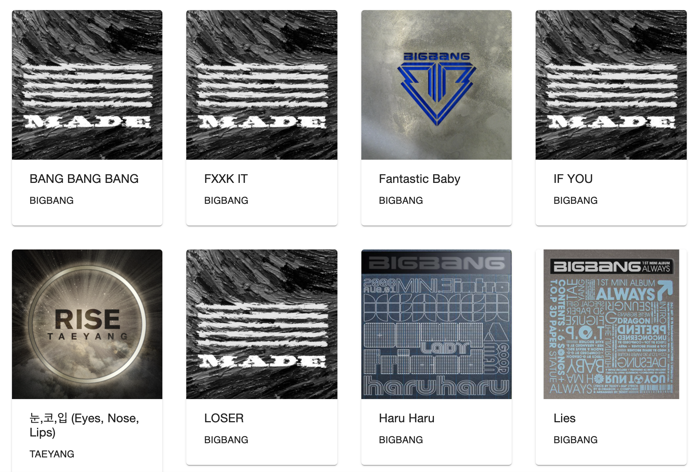
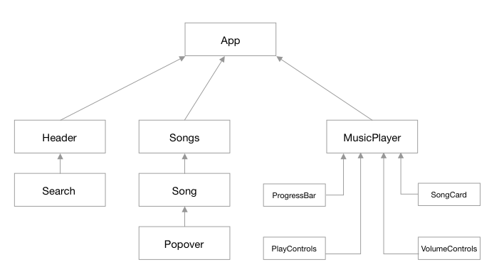
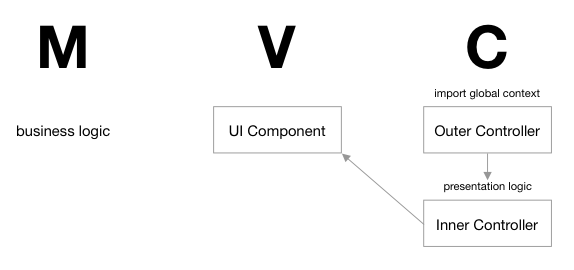
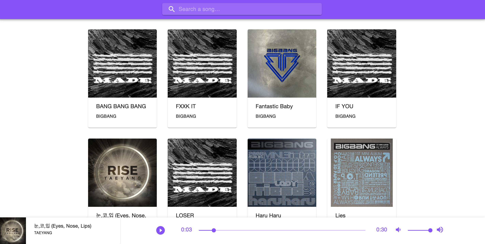
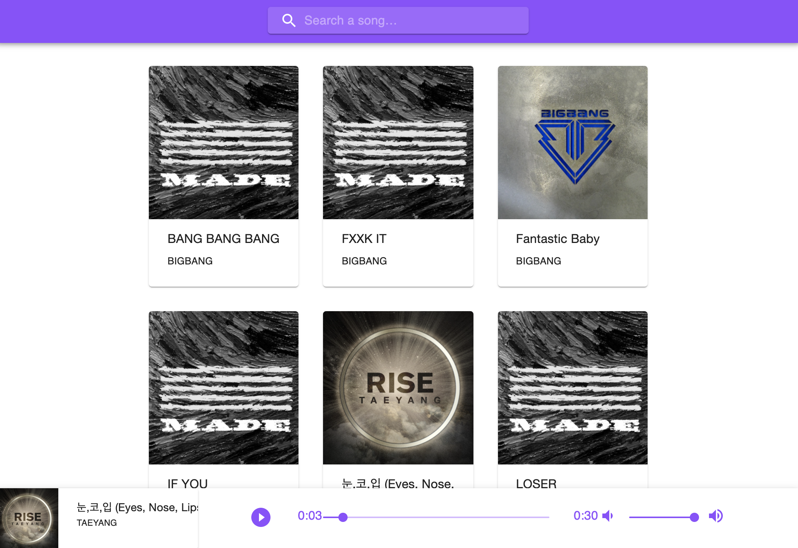
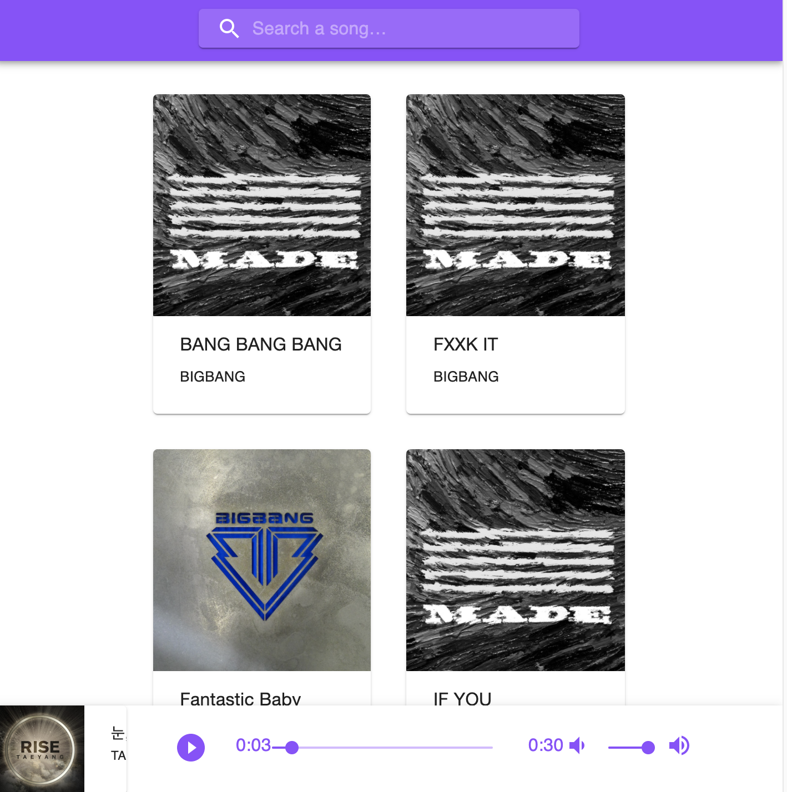
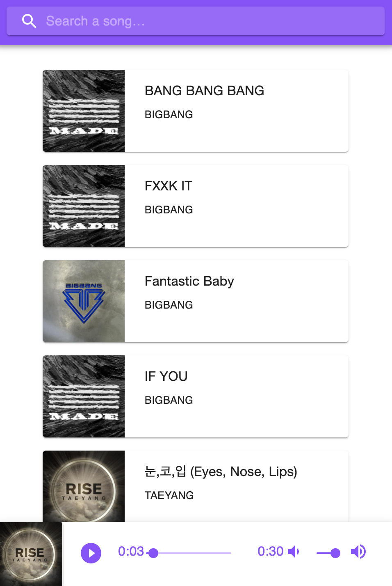

# Twitch Frontend Music Player

- Project: Audio playback app that let user search and play a song.
- View live: <a href='https://twitch-frontend.herokuapp.com//'>Twitch Frontend Music Player</a>

<br />

## Table of Contents

- [Technologies Used](#technologies-used)
- [Installation](#installation)
- [Featrues](#features)
- [Architecture Overview](#application-overview)
- [Requirements](#requirements)

<br />

## Technologies Used

- Languages: JavaScript, TypeScript
- Frontend: React
- Frameworks and Libraries: Material-UI
- API: Spotify

<br />

## Installation

1. Install packages

```
npm install
```

2. Create .env file, you can reference to `.env.example`

```
REACT_APP_SPOTIFY_CLIENT=<Your Spotify client ID here>
REACT_APP_SPOTIFY_SECRET=<Your Spotify Client Secret here>
```

3. Start server

```
npm start
```

<br />

## Features

1. Search a Song  
   

<br />

2. View Songs  
   

<br />

3. Play a Song  
   

<br />

## Architecture Overview

1. Relationships of Components  
   

2. Architecture Pattern  
   

3. API
   - POST request to get Spotify token
     ```
     {
       "access_token": "",
       "token_type": "Bearer",
       "expires_in": 3600
     }
     ```
   - GET request to fetch songs based on query string
     ```
      {
        "tracks": {
          "items": [
            {
              "albums": {},
              "artists": {},
                .
                .
                .
            }
          ]
        }
      }
     ```

4. Responsive View
   - Large Screen  
     
   - Medium Screen  
     
   - Small Screen  
      
   - Extra Small Screen  
      

5. User Flow
   - Type song name into search box, hit 'Enter'  
      User will see a list of songs
   - Hover over song card, users will see a play button
   - Click on a song, song will start playing
   - Control play/paused state, volumes and progress of a song with footer music player controls

6. Distinct design decisions
   - Use useContext and useReducer to manage states
   - Use OuterController to import Global Context values and use `React.memo` on InnerController to avoid excessive component rerendering

## Requirements

1. Use a modern JS Library/Framework
   - React

2. Three different user interactions
   - Search a song
   - Click song to play
   - Toggle play pause
   - Change progress bar to fast forward or rewind
   - Change volume

3. A specified architectural pattern
   - MVC

4. 3rd Party Restful API
   - Spotify  
     https://developer.spotify.com/documentation/web-api/

5. 5 UI components from Material-UI core
   - Grid
   - AppBar
   - InputBase
   - Paper
   - CardMedia
   - Typography
   - Popover
   - Slider

6. Reusable UI
   - Song Component
